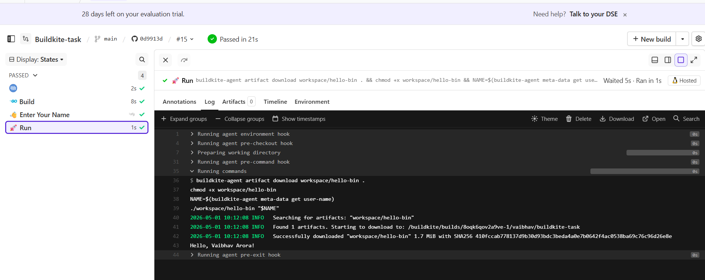

## Executive Summary

Engineering teams scaling their delivery pipelines consistently face
three problems: **inconsistent build environments** that cause failures
that are hard to reproduce, **unreliable state transfer** between
pipeline stages, and **CI infrastructure that becomes a maintenance
burden** rather than an enabler.

This pipeline implementation demonstrates how Buildkite solves all
three — and maps each decision directly to the business outcome it
produces.

---

## Why Buildkite

The core differentiator is architectural, not feature-based.
**Buildkite separates the control plane from the compute layer.**
The orchestration is managed by Buildkite; the agents run inside
the organisation's own environment. Source code, build artifacts,
and secrets never leave the customer's infrastructure — a structural
guarantee that fully managed platforms like GitHub Actions or
CircleCI cannot offer regardless of their compliance certifications.

For organisations in regulated industries or with enterprise customers
who audit their software supply chain, **this is not a nice-to-have —
it is a procurement requirement.**

---

## Solution Overview

A three-step pipeline implemented and validated end-to-end against
the provided Go application, connected via **real GitHub webhook
triggers** — reflecting how a customer would use Buildkite from day one.

Forked from: https://github.com/mkmrgn/example  
Solution repo: https://github.com/Vaibhavarora08/Buildkite-task

---

## Pipeline — Task to Implementation Mapping

This section maps each task requirement directly to the Buildkite
concept used, the implementation decision made, and the business
outcome it produces.

**Step 1 — Build the Go binary inside a Docker container**

| | |
|---|---|
| **Task requirement** | Build the Go application and upload the binary as a Buildkite artifact |
| **Buildkite concept** | Docker plugin + artifact store |
| **Implementation** | `golang:1.18.0` container via the Buildkite Docker plugin. Binary compiled as `hello-bin` and uploaded to the Buildkite artifact store using `buildkite-agent artifact upload` |
| **Key decision** | Non-obvious requirement: `mount-buildkite-agent: true` is mandatory for artifact operations inside Docker. Without it, the pipeline fails at runtime — a common first-run failure for teams adopting containerised builds. Go was deliberately not installed on the host to eliminate agent-level drift entirely, even at the cost of slightly longer build startup time |
| **Business outcome** | **Every build runs in an identical, isolated environment regardless of which agent picks it up.** Eliminates the environment drift that causes unreliable builds in Jenkins setups where build tooling lives on the agent itself |

**Step 2 — Block step for user input**

| | |
|---|---|
| **Task requirement** | Pause the pipeline and allow a user to enter their name |
| **Buildkite concept** | Block step + metadata store |
| **Implementation** | Block step with a structured text field (`key: user-name`). Value stored automatically in Buildkite's metadata store, scoped to the build |
| **Key decision** | Metadata chosen over external storage to keep the pipeline self-contained — optimising for simplicity over cross-build persistence. The artifact store is for files; metadata is for key-value state |
| **Observation** | **Block steps have no native timeout** — a pipeline waiting for approval waits indefinitely. Production mitigation: a watchdog job calling the Buildkite REST API to cancel after N minutes. Worth surfacing early with customers who have SLA commitments on their release pipelines |
| **Business outcome** | **Human approval gates map directly to existing change control and release management workflows** — without requiring custom tooling or external approval systems |

**Step 3 — Download artifact and execute with user input**

| | |
|---|---|
| **Task requirement** | Download the binary from Step 1 and run it with the name from Step 2 |
| **Buildkite concept** | Artifact download + metadata retrieval |
| **Implementation** | `buildkite-agent artifact download workspace/hello-bin .` followed by `buildkite-agent meta-data get user-name`. Binary executed as `./hello-bin "$NAME"` |
| **Key decision** | `$$NAME` not `$NAME` — Buildkite interpolates environment variables at **pipeline parse time**, not shell runtime. `$$` defers resolution to the shell. Rebuilding was intentionally avoided to guarantee artifact immutability across steps |
| **Business outcome** | **The exact binary built in Step 1 is promoted to Step 3** — no recompilation, no risk of code changing between steps. This is the artifact promotion pattern that underpins reliable deployment pipelines |

**Final output:**

---

## Infrastructure and Security Posture

This setup intentionally prioritises validation over optimisation.
A single EC2 agent was sufficient to prove pipeline correctness before
introducing ephemeral infrastructure — avoiding premature complexity
while keeping the path to production unchanged.

**Zero inbound ports — SSM Session Manager instead of SSH**  
Port 22 is closed. No key pairs. Agent access managed entirely through
AWS Systems Manager Session Manager with IAM role authentication.
**Every session is logged through CloudTrail** — a full audit trail
of who accessed what and when, with no additional tooling required.

**IMDSv2 enforced, hop limit 1**  
Protects against SSRF attacks — the same vulnerability class behind
several high-profile cloud breaches. Hop limit of 1 ensures containers
on the instance cannot reach the metadata endpoint, **preventing
container escape scenarios without any application-level changes.**

**Amazon Linux 2023 over Ubuntu**  
AWS-native, SSM Agent pre-installed, longer support lifecycle, and
better security defaults out of the box. The right default for any
customer running Buildkite agents on AWS.

**EC2 kept stopped when not in use**  
Eliminates idle compute cost for a validation deployment. In production
this is solved structurally — see Path to Production below.

---

## Path to Production

| Area | Validation deployment | Production deployment |
|---|---|---|
| **Agent infrastructure** | Single persistent EC2, stopped when idle | **Ephemeral agents** — spin up per build, terminate after. Spot-viable because Buildkite retries automatically on termination. Zero idle cost |
| **Agent compute** | Single EC2 instance | **ECS or EKS** for agent orchestration at scale — ECS for simplicity, EKS where the organisation already runs Kubernetes workloads. Buildkite's agent stack supports both natively |
| **Base image** | Standard Amazon Linux 2023 | **Golden AMI** — pre-baked with Docker, Buildkite agent, security tooling, and compliance controls. Eliminates bootstrap time per agent and ensures every agent starts from a known-good, audited baseline |
| **Artifact storage** | Buildkite managed store | **Customer-owned S3 bucket with KMS** — data residency guaranteed, encryption keys owned by the customer, bucket policies enforced. Satisfies SOC2, HIPAA, ISO 27001 artifact requirements |
| **Secrets management** | Buildkite metadata | **AWS Secrets Manager or SSM Parameter Store** — IAM-controlled access, encryption at rest, rotation policies, full audit trail |
| **Network architecture** | Default public subnet | **Private subnet with NAT Gateway and S3 VPC endpoints** — build traffic never traverses the public internet |
| **Pipeline triggers** | Webhook on push | **Webhook-driven with branch filtering, PR builds, and environment promotion gates** |
| **Binary integrity** | No signing | **GPG or Sigstore/cosign signing** — artifact signed at build time, signature verified before execution. Directly addresses software supply chain requirements |

**The pipeline definition itself requires no changes as infrastructure
matures.** Buildkite's separation of pipeline logic from execution
infrastructure means organisations adopt incrementally — without
rewriting a single pipeline step.

At scale, the primary failure mode shifts from build errors to state
integrity between steps — making artifact validation and idempotent
retries more critical than build logic itself.

---

## Observations for Customer Onboarding

Three behaviours encountered during implementation that will surface
in customer conversations:

**Variable interpolation difference from other CI platforms**  
Buildkite evaluates `$VAR` at pipeline parse time. Teams migrating
from GitHub Actions or Jenkins encounter this early. **A clear
explanation at onboarding prevents it becoming a trust issue** with
the platform.

**Docker builds require explicit agent mounting**  
`mount-buildkite-agent: true` must be set for artifact operations
to work inside containers. **Customers adopting Docker-based builds
will hit this in their first pipeline** — a guided setup path or
pre-configured base image removes this friction entirely.

**Block step timeout is a known gap**  
No native timeout on block steps. **Worth raising proactively** with
customers who have automated release pipelines or on-call SLAs,
along with the REST API workaround, rather than waiting for them
to discover it themselves.

---

The focus throughout was not just to build a working pipeline, but
to demonstrate how design decisions map to real-world engineering
and business outcomes.